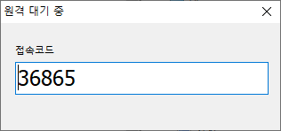
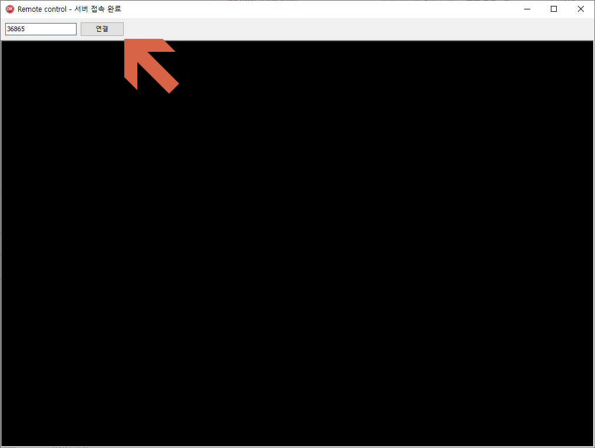

> DeskZip.dll은 개인의 사용이 아닌 경우에는 허용하지 않습니다.

# Remote Control

## Requirement
* https://github.com/ryujt/ryulib-delphi
* https://github.com/ryujt/supersocket

## 참고 사이트
* [http://10bun.tv/](http://10bun.tv/)

## 사용방법

### Gateway 서버 실행
* bin 폴더에 있는 remo_server.exe 파일을 아이피 공개된 외부에서 접속이 가능한 서버에서 실행합니다. 
* Options.ini 파일을 같은 폴더에 저장해주세요.
* Gateway 서버는 기본적으로 8282번 포트를 사용합니다.
* Options.ini 파일의 내용을 변경하면 포트를 변경할 수 있습니다. 포트를 변경하시면 클라이언트와 서버 모두 같은 포트로 변경해서 사용해야 합니다.

### 서버 실행

* 서버는 원격지원을 받을 PC에서 실행합니다.
* bin 폴더에 있는 remo_server.exe 파일을 실행하면 됩니다.
* DeskZip.dll 파일을 같은 폴더에 저장해주세요.
* Options.ini 파일을 같은 폴더에 저장해주세요.
* 서버가 실행되면 화면에 접속코드가 표시됩니다. 이것을 원격으로 접속할 사용자에게 전달해주시면 됩니다.

### 클라이언트 실행

* 클라이언트는 원격으로 접속할 PC에서 실행합니다.
* bin 폴더에 있는 remo_client.exe 파일을 실행하면 됩니다.
* DeskZip.dll 파일을 같은 폴더에 저장해주세요.
* Options.ini 파일을 같은 폴더에 저장해주세요.
* 서버 쪽에서 받은 접속코드를 입력창에 넣고 화살표가 가리키는 연결 버튼을 클릭합니다.
